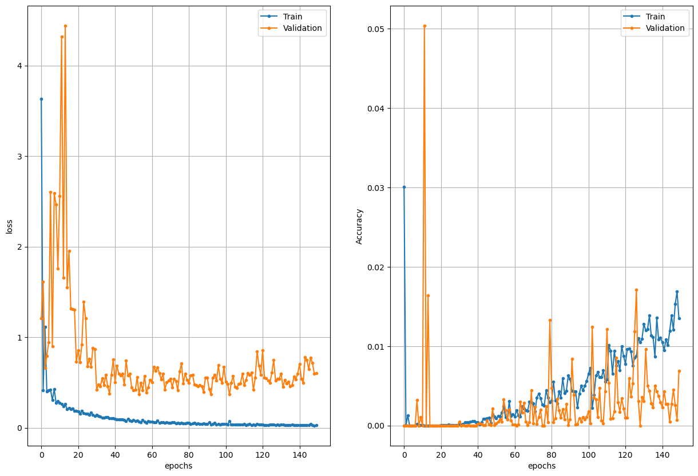
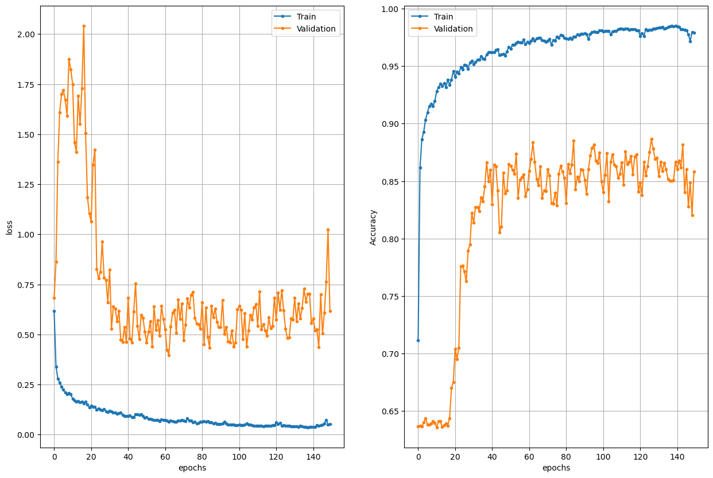

# computer-vision-house-mask

## The purpose of the project: 
### Obtaining a mask of a house from fortography, for further use of masks in a 3D reconstruction of a house.

## Prepare env with conda
1. Install conda or miniconda
2. Execute commnads:

    `conda env create -f env-file.yml`

    `conda activate tf-house-mask`
    
    `python -m ipykernel install --user --name tf-house-mask --display-name "Python 3.8 (tf-house-mask)" `

3. Run: `jupyter notebook`

## How train model see [Train](train.ipynb)

## How to eveluate pretrained model see [Predict](predict.ipynb)

## Base configuration of project:
BATCH_SIZE = 32

EPOCHS = 150

IMAGE_SIZE = (256, 256)

the model was trained using its custom dataset
data set size 720 images + annotation json file
For annotation used [LabelStudio](https://labelstud.io)

# Model taken as a basis from lesson 15 (UNetModel)
## Model params
Total params: 3,084,834

Trainable params: 3,081,058

Non-trainable params: 3,776

## Model Arhitecture

## Train model with splitin set on train and validation 
train time: 35min

## Results:
Images from data set

Images not from data set:

## Train model on all annotated data (without validation set)
train time: 41min

## Results:
Images from data set

Images not from data set:

# Model UNetModel2 using sigmoid and binary_crossentropy
## Model params
Total params: 1,968,513

Trainable params: 1,965,569

Non-trainable params: 2,944

## Model Arhitecture

## Train model with splitin set on train and validation 
train time: 23min

## Results:
Images from data set

Images not from data set:

## Train model on all annotated data (without validation set)
train time: 30min

## Results:
Images from data set

Images not from data set:

# Model UNetModel2 using softmax and sparse_categorical_crossentropy
## Model params
Total params: 1,968,530

Trainable params: 1,965,586

Non-trainable params: 2,944

## Train model on all annotated data (without validation set)
train time: 27min

## Results:
Images from data set

Images not from data set:

